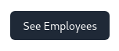
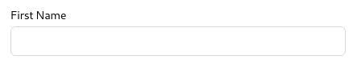
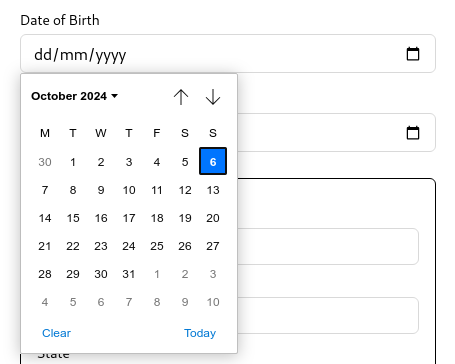
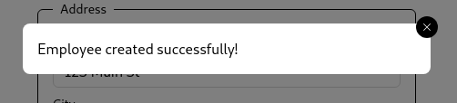
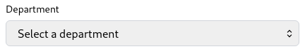
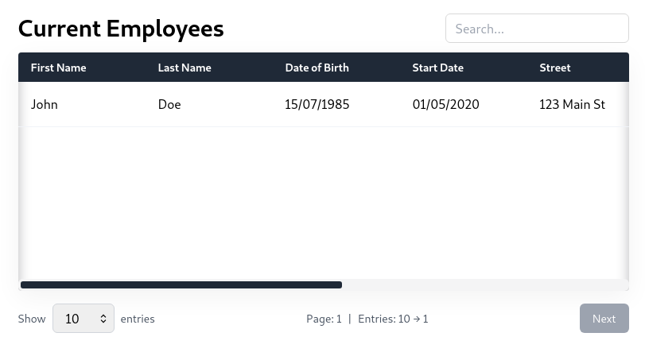

# Doom UI

Doom UI is a powerful and flexible UI library for building modern web applications. This library provides a set of reusable components that can be easily integrated into your projects.

## Installation

To install Doom UI, use npm:

```bash
npm install doom-ui
```

## Components examples

### Button



This component renders a customizable button element.

Props:

* `buttonProps` (ButtonHTMLAttributes<HTMLButtonElement>): Optional. Additional properties to be applied to the button element.
* `children` (string): Required. The text or elements to be displayed inside the button.
* `onClick` (() => void): Optional. Function to be called when the button is clicked.
* `type` (ButtonHTMLAttributes<HTMLButtonElement>["type"]): Optional. Specifies the type of the button. Default is "button".

```tsx
<Button
type="submit"
buttonProps={{
    disabled: isSubmitDisabled,
}}
>
Save
</Button>
```

### Input



This component renders a customizable input element.

Props:

* `error` (string): Optional. The error message to be displayed below the input.
* `id` (string): Optional. The id of the input element.
* `inputProps` (InputHTMLAttributes<HTMLInputElement>): Optional. Additional properties to be applied to the input element.
* `label` (string): Optional. The label to be displayed above the input.
* `type` (string): Optional. Specifies the type of the input. Default is "text".
* `endAdornment` (ReactNode): Optional. The element to be displayed at the end of the input.

```tsx
<Input
    id="last-name"
    label="Last Name"
    type="text"
    inputProps={{
        onChange: (e) => setValue("lastName", e.target.value),
    }}
    error={formState.errors["lastName"]?.message}
/>
```

### DatePicker



This component renders a customizable date picker element. (Using Input component internally)

Props:

* `error` (string): Optional. The error message to be displayed below the input.
* `id` (string): Optional. The id of the input element.
* `inputProps` (InputHTMLAttributes<HTMLInputElement>): Optional. Additional properties to be applied to the input element.
* `label` (string): Optional. The label to be displayed above the input.
* `endAdornment` (ReactNode): Optional. The element to be displayed at the end of the input.

```tsx
<DatePicker
    id="start-date"
    label="Start Date"
    inputProps={{
        onChange: (date) => setValue("startDate", date),
    }}
    error={formState.errors["startDate"]?.message}
/>
```

### Dialog



This component renders a customizable dialog element.

Props:

* `children` (ReactNode): Required. The content to be displayed inside the dialog.
* `closeOnOverlayClick` (boolean): Optional. Specifies whether the dialog should be closed when the overlay is clicked.
* `open` (boolean): Required. Specifies whether the dialog is open.
* `onClose` (() => void): Required. Function to be called when the dialog is closed.

```tsx
const ConfirmationDialog: FC<Props> = ({ open, onClose }) => {
  return (
    <Dialog open={open} onClose={onClose} closeOnOverlayClick>
      <div className="p-4">
        <h2 className="text-xl font-semibold">Dialog Title</h2>
        <p className="text-sm">Dialog content goes here.</p>
      </div>
    </Dialog>
  );
};
```

### Select



This component renders a customizable select element.

Props:

* `id` (string): Optional. The id of the select element.
* `onChange` ((e: ChangeEvent<HTMLSelectElement>) => void): Optional. Function to be called when the select value changes.
* `options` (SelectOption[]): Required. The options to be displayed in the select element.
* `inputProps` (SelectHTMLAttributes<HTMLSelectElement>): Optional. Additional properties to be applied to the select element.
* `label` (string): Optional. The label to be displayed above the select element.
* `error` (string): Optional. The error message to be displayed below the select element.

SelectOption:

```tsx
type SelectOption = {
    value: string;
    label: string;
};
```

```tsx
<Select
    id="showEntries"
    onChange={(e) => onSelectChange(e.target.value)}
    options={[
        { value: "10", label: "10" },
        { value: "20", label: "20" },
        { value: "50", label: "50" },
        { value: "100", label: "100" },
    ]}
/>
```

### Table



This component renders a customizable table element.
Uses a react context to manage the state of the table.

Props:

* `columns` (Column[]): Required. The columns to be displayed in the table.
* `rows` (Row[]): Required. The rows to be displayed in the table.
* `enablePagination` (boolean): Optional. Specifies whether pagination should be enabled.
* `enableSearch` (boolean): Optional. Specifies whether search should be enabled.
* `isLoading` (boolean): Optional. Specifies whether the table is loading.
* `title` (string): Optional. The title to be displayed above the table.

Column:

```tsx
type TableColumnType = {
    key: string;
    label: string;
};
```

Row:

```tsx
type TableRowType = {
    [key: string]: TableRowValue;
};

type TableRowValue = {
    value: string;
    hide?: boolean;
};
```

```tsx
const columns: TableColumnType[] = [
    { key: "name", label: "Name" },
    { key: "email", label: "Email" },
    { key: "role", label: "Role" },
];

const rows: TableRowType[] = [
    {
        name: { value: "John Doe" },
        email: { value: "john.doe@mail.com", hide: true },
        role: { value: "Admin" },
    },
    {
        name: { value: "Jane Doe" },
        email: { value: "jane.doe@mail.com", hide: true },
        role: { value: "User" },
    },
];

return <Table
    columns={columns}
    rows={rows}
    enablePagination
    enableSearch
    isLoading={isFetchingEmployees}
    title="Current Employees"
/>
```

## Contact

For any questions or feedback, please open an issue on our [GitHub repository](https://github.com/Zansuken/doom-ui).
